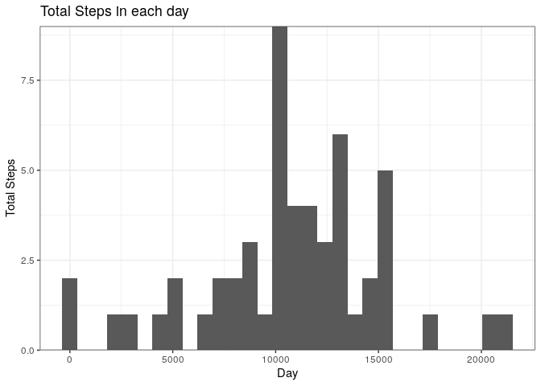
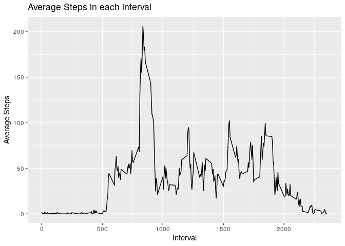
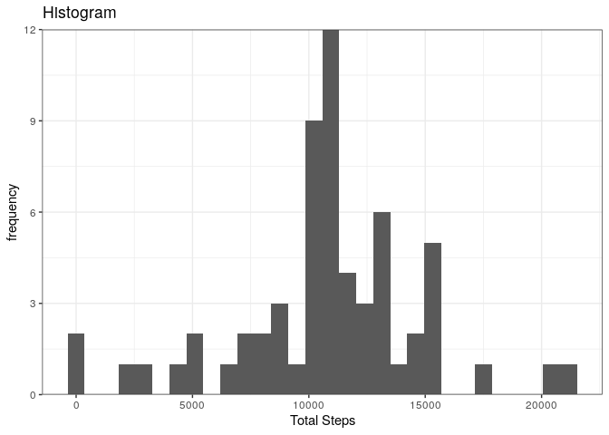
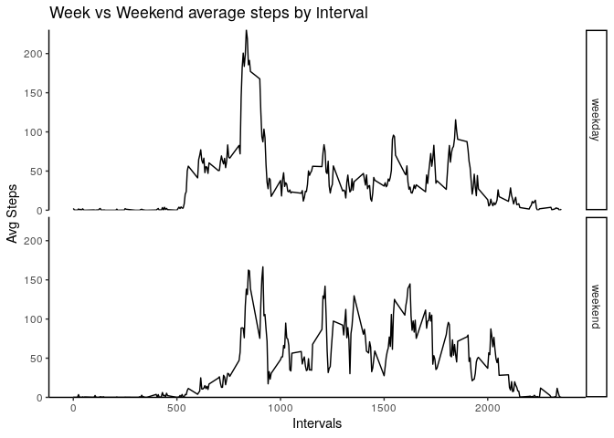

## Loading and preprocessing the data

```r
library(dplyr)
```

```
## 
## Attaching package: 'dplyr'
```

```
## The following objects are masked from 'package:stats':
## 
##     filter, lag
```

```
## The following objects are masked from 'package:base':
## 
##     intersect, setdiff, setequal, union
```

```r
library(ggplot2)
unzip('activity.zip')
data<- read.csv('activity.csv', stringsAsFactors = FALSE)
data$date <- as.Date(data$date,'%Y-%m-%d') 
data <- as_tibble(data)
```
## What is mean total number of steps taken per day?


```r
step_sum <- group_by(data[complete.cases(data),], date)%>% summarise(total = sum(steps, na.rm =TRUE))
ggplot(step_sum, aes(x = total))+geom_histogram(bins = 30)+labs(x = 'Day',y = 'Total Steps', title = 'Total Steps in each day')+ theme_bw()+scale_y_continuous(expand = c(0, 0)) 
```

<!-- -->

```r
cat('Mean of total number of steps taken per day',mean(step_sum$total))
```

```
## Mean of total number of steps taken per day 10766.19
```

```r
cat('\n')
```

```r
cat('Mean of total number of steps taken per day',median(step_sum$total))
```

```
## Mean of total number of steps taken per day 10765
```

## What is the average daily activity pattern?


```r
intTimeAvg <-group_by(data[complete.cases(data),], interval)%>% summarise(avg =mean(steps, na.rm =TRUE))
ggplot(intTimeAvg, aes(x = interval, y = avg))+ geom_line()+
        labs(x = 'Interval',y = 'Average Steps', title = 'Average Steps in each interval')
```

<!-- -->

```r
cat('The',intTimeAvg[which.max(intTimeAvg$avg), ]$interval,'th interval contains the maximum average number of steps=',max(intTimeAvg$avg) )
```

```
## The 835 th interval contains the maximum average number of steps= 206.1698
```
## Imputing missing values

```r
attach(data)
sum(is.na(interval))
```

```
## [1] 0
```

```r
sum(is.na(steps))
```

```
## [1] 2304
```

```r
sum(is.na(date))
```

```
## [1] 0
```

```r
cat('There are', sum(is.na(steps)), 'NAs in the steps column')
```

```
## There are 2304 NAs in the steps column
```


```r
null <-data%>% group_by(date)%>%summarise(total = mean(steps))%>%is.na()
sum(null[,2])
```

```
## [1] 8
```
There are 8 dates with no measurements of steps, and therefore using the mean of steps by date doesn't solve the problem. Let's check the same for interval

```r
null2 <-data%>% group_by(interval)%>%summarise(total = mean(steps, na.rm =TRUE))%>%is.na()
sum(null2[,2])
```

```
## [1] 0
```
There is atleast one value of steps for each interval. Thus, imputing via the means of the interval number.The following function will allow imputing missing values using the 5-min interval mean


```r
vals  <-data%>% group_by(interval)%>%summarise(avg = mean(steps, na.rm =TRUE))
imputer<- function(vals,data){
        vals <- as.data.frame(vals)
        data <- as.data.frame(data)
        imputedData <- c()
        for(i in 1:nrow(data)){
                if(is.na(data[i,'steps'])== T){
                        imputedData[i]<- vals[vals$interval==data[i,'interval'],]$avg
                }
                else{
                         imputedData[i] <-  data[i,"steps"]
                }
        }
        imputedData
}
```


```r
data$imputedSteps <- imputer(vals, data)
imputed_sum <- group_by(data, date)%>% summarise(total = sum(imputedSteps, na.rm =TRUE))
imputed_sum$total <- as.integer(imputed_sum$total)
ggplot(imputed_sum, aes(x = total))+geom_histogram(bins = 30)+labs(y = 'frequency',x = 'Total Steps', title = 'Histogram')+ theme_bw()+scale_y_continuous(expand = c(0, 0)) 
```

<!-- -->

```r
cat('Mean of total number of steps taken per day',mean(imputed_sum$total))
```

```
## Mean of total number of steps taken per day 10766.16
```

```r
cat('\n')
```

```r
cat('Median of total number of steps taken per day',median(imputed_sum$total))
```

```
## Median of total number of steps taken per day 10766
```
There is no significant difference because the msising values are computed from mean.

## Are there differences in activity patterns between weekdays and weekends?


```r
data$day <- ifelse(as.POSIXlt(data$date)$wday %in% c(1:5), 'weekday', 'weekend')
data$day<- as.factor(data$day)
imputed_sum <- data%>%group_by( day,interval)%>% summarise(avgSteps = mean(imputedSteps, na.rm =TRUE))
```

```
## `summarise()` has grouped output by 'day'. You can override using the `.groups` argument.
```

```r
ggplot(imputed_sum, aes(interval, avgSteps))+geom_line()+facet_grid(day~.)+ 
        labs(x = 'Intervals',y = 'Avg Steps', title = 'Week vs Weekend average steps by interval')+theme_classic()+scale_y_continuous(expand = c(0, 0)) 
```

<!-- -->

There is a decrease of average steps taken per day on the weekends for shorter intervals but appears to have increases for bigger intervals


